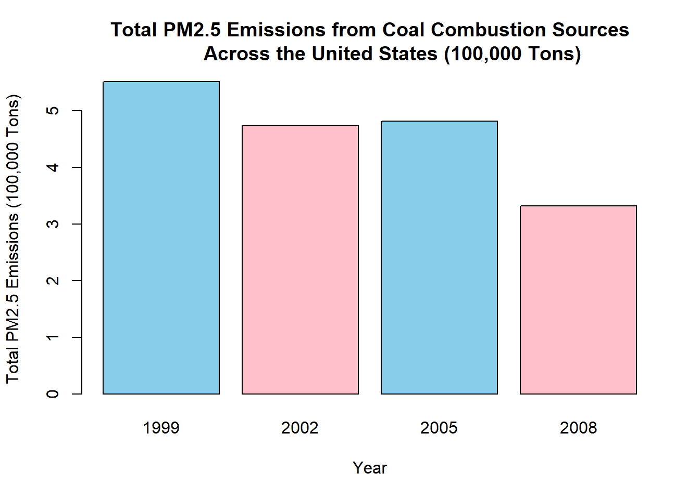
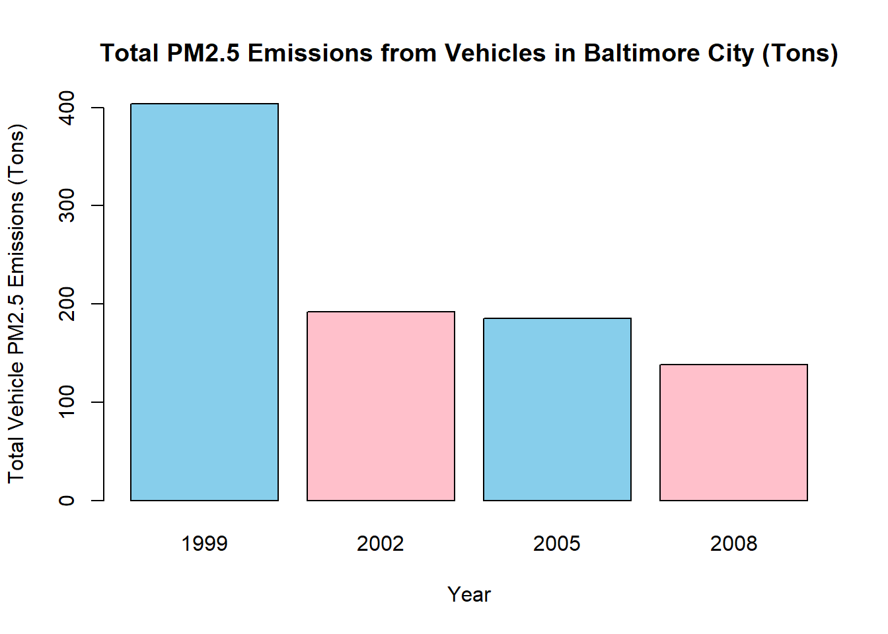
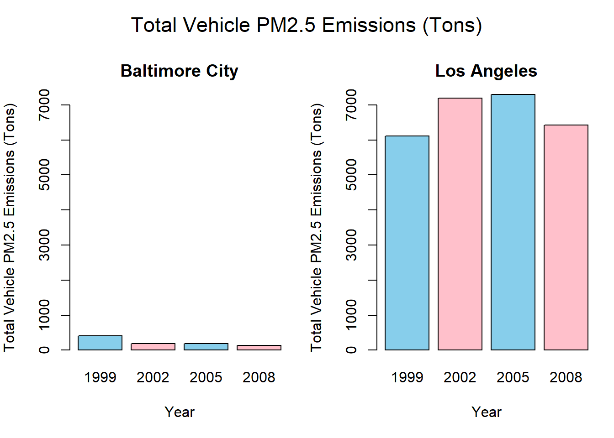

```r
library(dplyr)
library(ggplot2)
```

```r
NEI <- readRDS("summarySCC_PM25.rds")
SCC <- readRDS("Source_Classification_Code.rds")
```


###Question 1


```r
Totals <- tapply(NEI$Emissions,NEI$year,sum)

barplot(Totals/10^6, main = "Total PM2.5 Emissions in the United States (1,000,000 Tons)",
        xlab = "Year",
        ylab = "PM2.5 Emissions (1,000,000 Tons)",
        col = c("sky blue", "pink")
)
```

<!-- -->

####Total emissions have decreased in the US from 1999 to 2008.


###Question 2


```r
Baltimore <- filter(NEI, fips == "24510")

TotalsBaltimore <- tapply(Baltimore$Emissions,Baltimore$year, sum)

barplot(TotalsBaltimore, main = "Total PM2.5 Emissions in Baltimore City (Tons)", 
        xlab = "Year", 
        ylab = "PM2.5 Emissions (Tons)", 
        col = c("sky blue", "pink")
)
```

<!-- -->

####The total emissions from PM2.5 have decreased in Baltimore City, Maryland from 1999 to 2008.


###Question 3


```r
Baltimore <- filter(NEI, fips == "24510")

ggplotBaltimoreBySourceType <- ggplot(Baltimore, aes(factor(year), Emissions, fill = type)) +
  geom_bar(stat = "identity") +
  theme_bw() + 
  guides(fill = FALSE)+
  facet_grid(.~type, scales = "free", space = "free") + 
  labs(x = "Year", y = expression("Total PM"[2.5]*" Emissions (Tons)")) + 
  labs(title = expression("PM"[2.5]*" Emissions by Source Type in Baltimore City (Tons)")
)

print(ggplotBaltimoreBySourceType)
```

<!-- -->

####The non-road, nonpoint, on-road source types have all seen decreased emissions overall from 1999-2008 in Baltimore City.

####Only the point source type has seen an increase in emissions from 1999 until 2005 at which point decreases again until 2008.


###Question 4


```r
combustion <- grepl("comb", SCC$SCC.Level.One, ignore.case=TRUE) 
coal <- grepl("coal", SCC$SCC.Level.Four, ignore.case=TRUE) 

combcoal <- (combustion & coal) 
combcoalscc <- SCC[combcoal, ]$SCC 
combcoalnei <- NEI[NEI$SCC %in% combcoalscc,] 

x <- tapply(combcoalnei$Emissions, combcoalnei$year, sum)

barplot(x/10^5, main = "Total PM2.5 Emissions from Coal Combustion Sources
        Across the United States (100,000 Tons)", 
        xlab = "Year", 
        ylab = "Total PM2.5 Emissions (100,000 Tons)",
        col = c("sky blue", "pink")
)
```

<!-- -->

####Emissions from coal combustion-related sources have decreased over the years.

####We can see that emissions have dropped by about a third of the total emissions from 1999 to 2008.


###Question 5


```r
Baltimore <- filter(NEI, fips == "24510")

vehicle <- grepl("vehicle", SCC$SCC.Level.Two, ignore.case=TRUE)
vehicleSCC <- SCC[vehicle, ]$SCC
vehicleBaltimore <- Baltimore[Baltimore$SCC %in% vehicleSCC,]

y <- tapply(vehicleBaltimore$Emissions, vehicleBaltimore$year, sum)

barplot(y, main = "Total PM2.5 Emissions from Vehicles in Baltimore City (Tons)", 
        xlab = "Year", 
        ylab = "Total Vehicle PM2.5 Emissions (Tons)",
        col = c("sky blue","pink")
)
```

<!-- -->

####Emissions from motor-vehicle sources have decreased from 1999 until 2008.

####Emissions have dropped by a about three eigths from 1999 to 2008.


###Question 6
                

```r
Baltimore <- filter(NEI, fips == "24510")
LosAngeles <- filter(NEI, fips == "06037")

vehicle <- grepl("vehicle", SCC$SCC.Level.Two, ignore.case=TRUE)
vehicleSCC <- SCC[vehicle, ]$SCC
vehicleBaltimore <- Baltimore[Baltimore$SCC %in% vehicleSCC,]
vehicleLosAngeles <- LosAngeles[LosAngeles$SCC %in% vehicleSCC,]

a <- tapply(vehicleBaltimore$Emissions, vehicleBaltimore$year, sum)

b <- tapply(vehicleLosAngeles$Emissions, vehicleLosAngeles$year, sum)

par(mfrow=c(1,2), mar=c(4, 4, 4, 1), oma=c(1, 0, 2, 0))

barplot(a, main = "Baltimore City",
        xlab = "Year",
        ylab = "Total Vehicle PM2.5 Emissions (Tons)",
        col = c("sky blue", "pink"),
        ylim = c(0,7000)
)

barplot(b, main = "Los Angeles",
        xlab = "Year",
        ylab = "Total Vehicle PM2.5 Emissions (Tons)",
        col = c("sky blue","pink"),
        ylim = c(0,7000)
)

mtext("Total Vehicle PM2.5 Emissions (Tons)", side=3, outer=TRUE, cex=1.4)
```

<!-- -->

####The total PM2.5 emissions from vehicle sources has decreased over the given time period in Baltimore City, but has increased with time in Los Angeles.

####It can be seen that Los Angeles has the greater changes from 1999 to 2008 in motor vehicle emissions.
